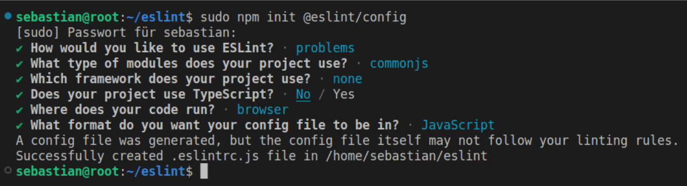

```diff
- #S TILL IN BETA
```
# Statische Code Analyse mit ESLint und Semgrep


# ESLINT
Unter der Voraussetzung, dass der Paketmanager npm installiert ist, kann ESLint einfach mit dem Befehl “npm init @eslint/config” installiert und konfiguriert werden. Dabei wird nach Beantwortung der im folgenden Bild zu sehenden Fragen eine eslintrc.js Datei erstellt, welche die Konfigurationsdatei darstellt.



## Installtion
Installtion
## Konfiguration
Konfiguration
## Regeln
Regeln


# Semgrep
ESLint, was ist es ?
## Installation
Installtion
## Konfiguration
Konfiguration
## Regeln
Regeln
