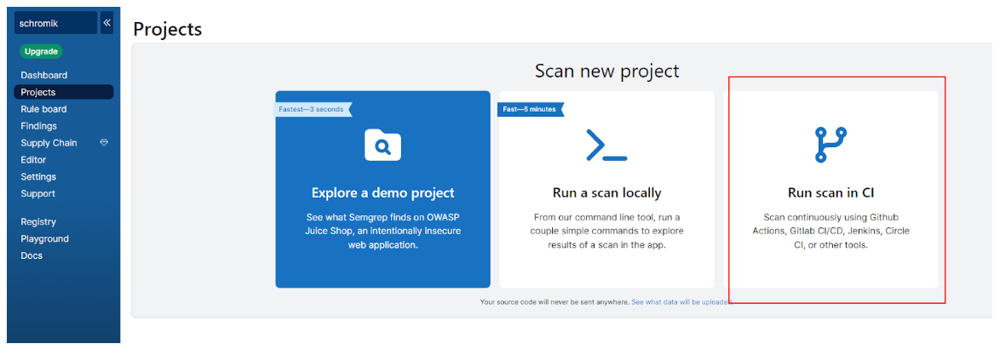

# Statische Code Analyse mit ESLint und Semgrep

Dieses Repository wurde im Rahmen der Projetarbeit für das Wahlpflichtmodul "Technischer Datenschutz und Mediensicherheit" erstellt.

Für ein besseres Verständnis, empfiehlt es sich um vorhinein die Projektdokumentation zu lesen.

# ESLINT

## Installtion

Unter der Voraussetzung, dass der Paketmanager npm installiert ist, kann ESLint einfach mit dem Befehl 
**“npm init @eslint/config”**
installiert und konfiguriert werden. 

Nach der Beantwortung der Fragen wird die die Konfigurationsdatei im gewünschten Format erstellt, in diesem Fall "**.eslintrc.js**".

## Konfiguration

Die Konfigurationdatei (eslintrc.js) enthält die angegebenen Informationen und kann darüher hinaus noch erweitert werden.

Standardmäßig ist der Befehl "**"extends": "eslint:recommended"**" enthalten, welcher die vordefinierten Regeln anwendet,
welche das sind, kann hier nachgesehen werden: https://eslint.org/docs/latest/rules/

Regeln können dabei als "off", "warn" oder "error" hinterlegt sein. Ebenfalls durch "0", "1" und "2" repräsentierbar.

Dabei können diese Regeln global in der "eslintrc.js" unter "rules" festgelegt werden, es besteht aber auch die Möglichkeit diese im Code selbst,
als Kommentar zu verwalten. Dafür würde beispielsweise mit dem Kommentar "**/* eslint no-unsafe-finally: 0 */**" die genannt Regel deaktiviert werden. 

## Regeln

Für die Implementation eigener Regeln bzw. Plugins empfiehlt es sich nun einen Ordner zu erstellen, in diesem Fall habe ich ihn "eslint" genannt.
In dem Ordner befinden sich drei Arten von Files.
**no-return-trycatch.js** -> Diese enthält die Implementation der Regel in JavaScript, welche auch im Projektbericht erklärt wurde.
**index.js** -> Diese "verbindet" den Namen der Regel mit dem Namen des Moduls in welchem sie Implementiert ist.
**package.json** -> Über die package.json wird der Name des Plugins festgelegt, sowie der Entrypoint (index.js)

In diesem Ordner können nun auch weitere JavaScript Files angelegt werden, welche zusätzliche Regeln definieren.
Diese müssen dann nur noch in der index.js bekannt gemacht werden.

# Semgrep

## Installation

Die Installation vom Semgrep erfolgt einfach und schnell mit **"python3 -m pip install semgrep"**.

Anschließend können direkt vordefinierte Scans mit **"semgrep --config=REGELSETNAME"** ausgeführt werden.
Welche vorgefertigen Regelsets es gibt und welche Regeln sie Implementieren kann unter https://semgrep.dev/explore nachgesehen werden.
Beispielsweise könnte also **"semgrep --config=owasp-top-ten"** ausgeführt werden.

## Regeln

Für die Definition eigener Regeln muss lediglich eine yaml-Datei erstellt werden, in diesem Fall habe ich sie "semgrepRules.yml" genannt.
Diese Regeln können dann einfach mit dem Befehl "**semgrep -f semgrepRules.yml**" angewendet werden.

# CI-Pipeline

Github nennt seine CI/CD Lösung ”Actions” bzw. die Pipelines werden als “Workflows” bezeichnet. Ein neuer Workflow kann unter dem Reiter “**Actions**” dann “**New workflow**” und anschließend “**set up a workflow yourself**” eingerichtet werden. Dies ist nichts anderes als ein Pipeline-Skript im yaml-Format.

## ESLint
Für **ESLint** wird hier das Skript "**eslint.yml**" unter "**.github/workflows**" verwendet. Im Prinzip wird hier lediglich zuerst ESLint installiert und dann mittels "**npx eslint ./thisCodeGetsTested--config .eslintrc.js --ext .js,.jsx,.ts,.tsx**" ausgeführt. Dabei werden die Konfigdatei und die zu scannenden Dateiendungen angegeben. 

## Semgrep
Für **Semgrep** gibt es hier eine elegante Lösung mittel einer GUI, welche unter semgrep.dev zur Verfügung steht.
Dort kann man sich mit seinem Github Account Anmeldung und anschließend eine Pipeline konfigurieren.

Unter Projects kann ein neue Pipeline angelegt werden, die nachfolgenden Bilder zeigen dabei das Setup.

Nun können die Regeln unter "**Rule board**" verwaltet werden, dabei kann je nach Spalte entschieden werden, 
was passieren soll wenn eine Regel verletzt wird.

Auch hier können ebenfalls vorgefertigte Regeln über "**Add rules**" hinzugefügt werden.
Eigene Regel können unter "**Editor**" angelegt und anschließend zu der gewünschten Spalte hinzugefügt werden.

Werden Änderungen in der GUI vorgenommen, werden diese ebenfalls für die Pipeline übernommen.
